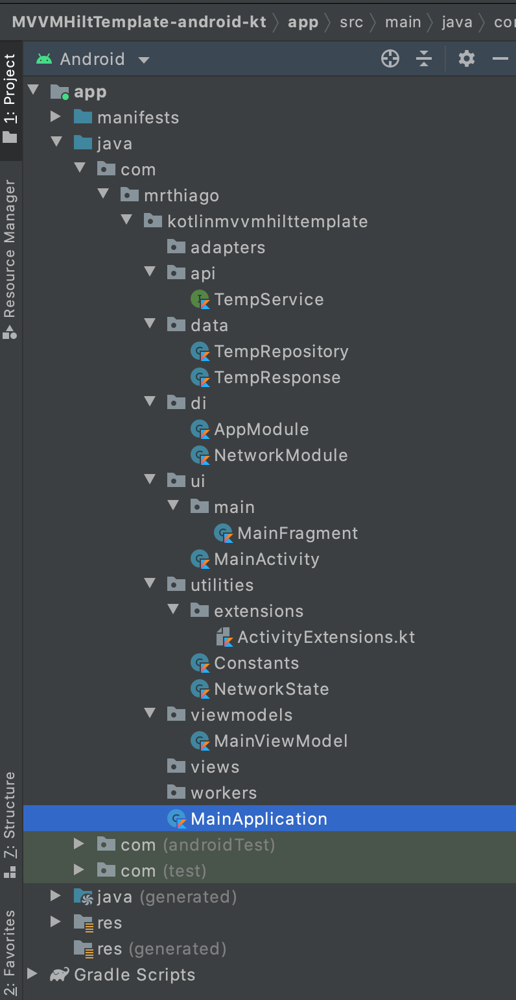
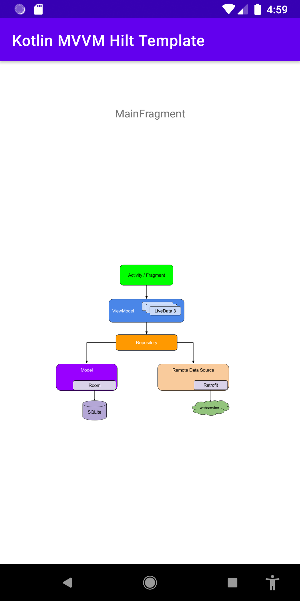

# Android Kotlin MVVM with Hilt project template
This is a template project for MVVM with Hilt and ViewModel.

I use this as a starter project and to test new dependencies library versions.

### More Information
View binding -> https://medium.com/androiddevelopers/use-view-binding-to-replace-findviewbyid-c83942471fc

View Model Training -> https://developer.android.com/codelabs/kotlin-android-training-view-model#0

The Clean Code Blog by "Uncle Bob" ->  https://blog.cleancoder.com/uncle-bob/2012/08/13/the-clean-architecture.html

---	
## Screenshots
|  |  |